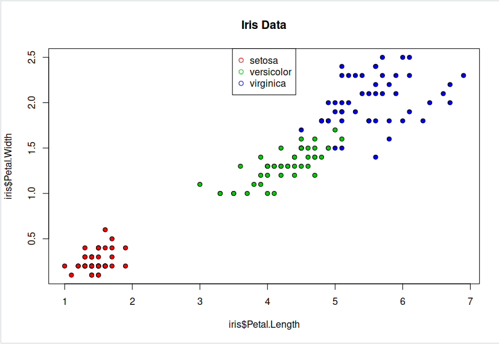
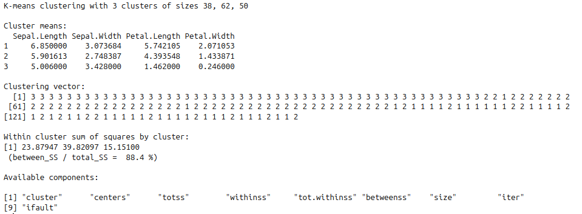
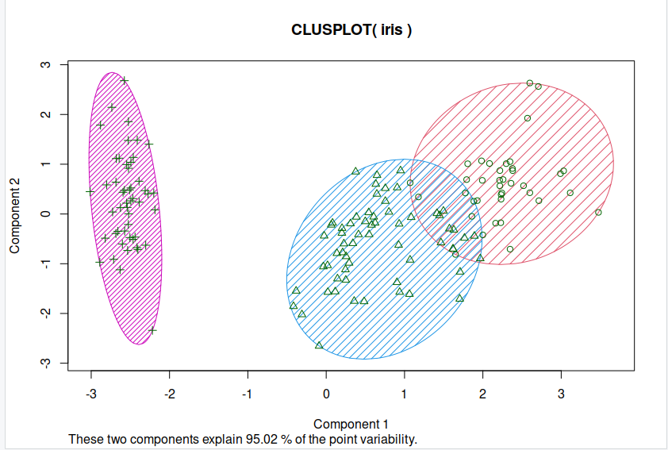
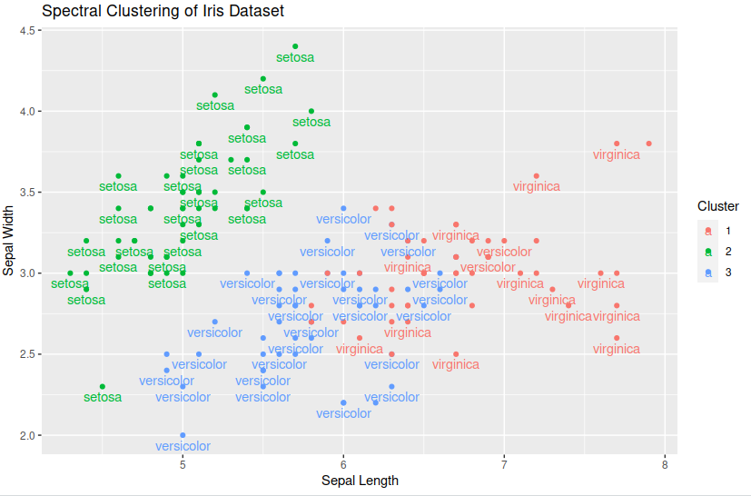

# Clustering

Clustering involves the categorisation of data points based on their similarities, offering a robust method for detecting patterns within datasets. It typically operates without the need for training, distinguishing it as an unsupervised learning approach. This lack of training requirement facilitates swift application..

## Applications of Clustering
* Looking for trends in data
* Data compression, all data clustering around a point can be reduced to just that point. For example, reducing colour depth of an image.
* Pattern recognition

## K-means Clustering

he K-means clustering algorithm is a straightforward technique aimed at pinpointing the centroid of each cluster. It achieves this by seeking a point that minimizes the distance between the centroid and all the points within the cluster. While the algorithm requires a predetermined number of clusters to identify, a common approach involves experimenting with various cluster numbers and employing additional tests to determine the optimal configuration.

[Image from analyticsvidhya](https://www.analyticsvidhya.com/blog/2021/04/k-means-clustering-simplified-in-python/)

### Lets look at our data
So firstly lets have a look at the features within our dataset: 

~~~
> data("iris") ## load in data
> head(iris) ## show just the first few rows
~~~
{: .language-r}

><pre style="color: black; background: white;">
>  Sepal.Length Sepal.Width Petal.Length Petal.Width Species
>1          5.1         3.5          1.4         0.2  setosa
>2          4.9         3.0          1.4         0.2  setosa
>3          4.7         3.2          1.3         0.2  setosa
>4          4.6         3.1          1.5         0.2  setosa
>5          5.0         3.6          1.4         0.2  setosa
>6          5.4         3.9          1.7         0.4  setosa
></pre>
{: .output}

we could also compare different features, lets compare Petal length against Petal width:

~~~
> plot(iris$Petal.Length, iris$Petal.Width, pch=21, bg=c("red","green3","blue")[unclass(iris$Species)], main="Iris Data") ## plot two features against each other
> legend("top", levels(iris$Species), pch = 21,col = c("red","green3","blue")) ### well of course we want a legend
~~~
{: .language-r}
>
{: .output}

As observed, the "setosa" species appears to cluster more distinctly, while there is some overlap or noise between "versicolor" and "virginica," despite their apparent similarity.
Now, let's execute the model. Since the kmeans function is included in the base package of R, there's no need to install any additional packages.
When using the kmeans function, it's essential to specify the "centers" parameter, which represents the number of clusters we intend to create. In this scenario, we know that the appropriate value is 3. Let's proceed by setting it accordingly.
Now lets try and cluster all the features

~~~
> set.seed(0)
> irisCluster <- kmeans(iris[,1:4], center=3, nstart=20) ### take only the data columns that we want
> irisCluster
~~~
{: .language-r}

>
{: .output}

Now lets have a look at the 3 clusters the model has come up with. To do this we use a library called “cluster”, so we can see the regions/groups that the points have been separated into.

~~~
> library(cluster)
> clusplot(iris, irisCluster$cluster, color=T, shade=T, labels=0, lines=0) ## special kind of plot for showing clusters
~~~
{: .language-r}

>
{: .output}

### Limitations of K-Means

* Requires number of clusters to be known in advance
* Struggles when clusters have irregular shapes
* Will always produce an answer finding the required number of clusters even if the data isn't clustered (or clustered in that many clusters).
* Requires linear cluster boundaries

### Advantages of K-Means

* Simple algorithm, fast to compute. A good choice as the first thing to try when attempting to cluster data.
* Suitable for large datasets due to its low memory and computing requirements.

# Spectral Clustering

Spectral clustering is a method utilised in machine learning and data analysis to cluster data points according to their likeness. This approach entails converting the data into a format where clusters are discernible, followed by applying a clustering algorithm to this altered data. In the R Programming Language, spectral clustering achieves this transformation by leveraging the eigenvalues and eigenvectors of a similarity matrix.

Spectral clustering works by transforming the data into a lower-dimensional space where clustering is performed more effectively. The key steps involved in spectral clustering are as follows:
### Affinity Matrix

Begin with a dataset containing data points. Calculate an affinity or similarity matrix that measures the connections between these data points, indicating their level of similarity or correlation. This matrix encapsulates the degree of similarity or relationship between each pair of data points. Popular methods for computing affinity include Gaussian similarity, k-nearest neighbors, or a custom similarity function provided by the user.
### Graph Representation

View the affinity matrix as the adjacency matrix of a weighted undirected graph. In this graph, each data point represents a vertex, and the edge weight between vertices indicates the similarity between the respective data points.

### Laplacian Matrix

Construct the graph Laplacian matrix, which captures the connectivity of the data points in the graph. There are two main types of Laplacian matrices used in spectral clustering.

Unnormalized Laplacian: L = D – A, where D is the degree matrix and A is the affinity matrix. The degree of a vertex is the sum of the weights of its adjacent edges.
Normalized Laplacian: L_norm = I – D^(-1/2) * A * D^(-1/2), where D^(-1/2) is the diagonal matrix of the inverse square root of the node degrees.

### Eigenvalue Decomposition

Compute the eigenvalues (λ_1, λ_2, …, λ_n) and the corresponding eigenvectors (v_1, v_2, …, v_n) of the Laplacian matrix. You typically compute a few eigenvectors, corresponding to the smallest non-zero eigenvalues.

###Embedding

Use the selected eigenvectors to embed the data into a lower-dimensional space. The eigenvectors represent new features that capture the underlying structure of the data. The matrix containing these eigenvectors is referred to as the spectral embedding.
~~~
### Using Euclidean distance as a similarity measure
> similarity_matrix <- exp(-dist(iris[, 1:4])^2 / (2 * 1^2))
 
### Compute Eigenvalues and Eigenvectors
> eigen_result <- eigen(similarity_matrix)
> eigenvalues <- eigen_result$values
> eigenvectors <- eigen_result$vectors
 
### Choose the First k Eigenvectors
> k <- 3 
> selected_eigenvectors <- eigenvectors[, 1:k]
 
### Apply K-Means Clustering
> cluster_assignments <- kmeans(selected_eigenvectors, centers = k)$cluster
 
### Add species information to the clustering results
> iris$Cluster <- factor(cluster_assignments)
> iris$Species <- as.character(iris$Species)

### Plot the 

> library(ggplot2)

> ggplot(iris, aes(Sepal.Length, Sepal.Width, color = Cluster, label = Species)) + geom_point() +
   geom_text(check_overlap = TRUE, vjust = 1.5) +
   labs(title = "Spectral Clustering with k-means of Iris Dataset",
        x = "Sepal Length", y = "Sepal Width")

~~~
{: .language-r}

>
{: .output}

> ## Exercise: Increasing the number of cluster centres
> Have ago at increasing the number of centres for you K-means cluster to find. What does it look like if you try 4,5 or even 6?
> How could we find the most optimal amount?
{: .challenge}


