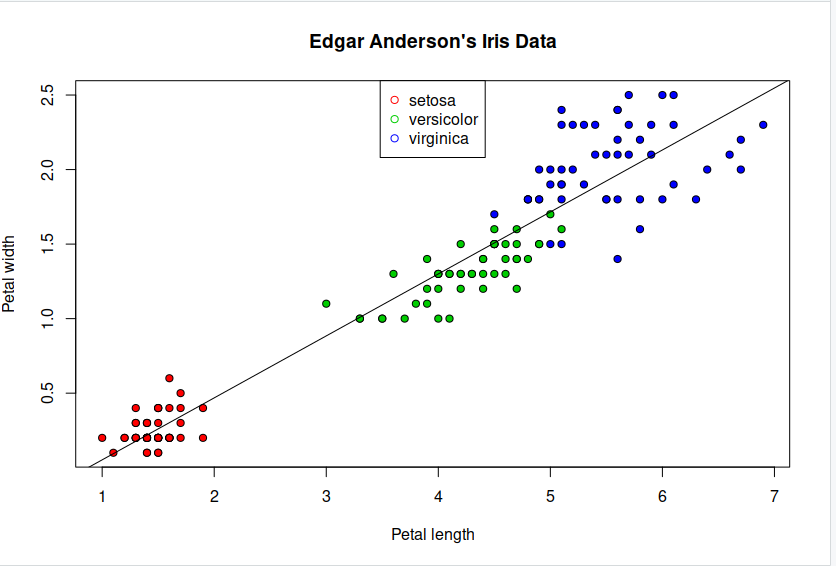
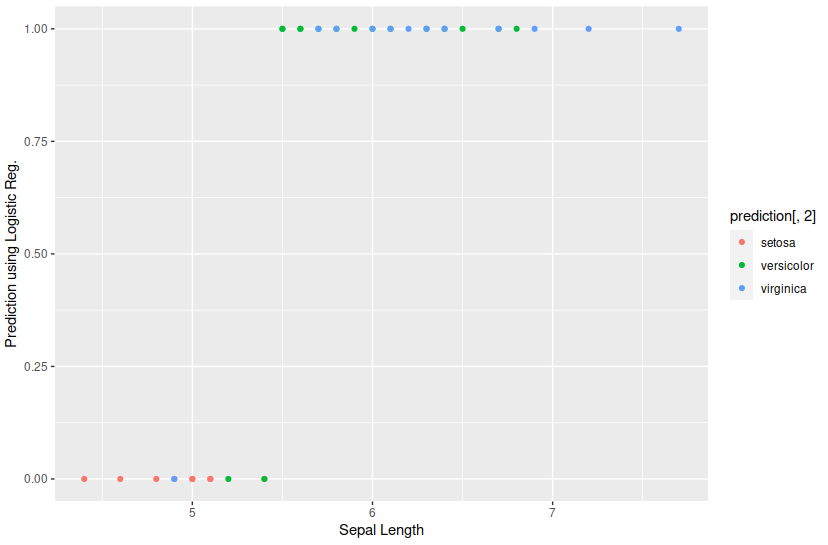

# Linear regression

We now possess a basic linear model for a given dataset. It would be valuable to assess the accuracy of this model. One way to achieve this is by computing the predicted y-values for each x-value in our original dataset and comparing them with the actual y-values. We can aggregate these individual discrepancies into a single comprehensive error metric by calculating the least squares. This involves squaring each difference, summing them all, dividing the sum by the total number of observations, and then taking the square root of the result. By squaring and subsequently taking the square root, we prevent negative errors from offsetting positive ones, thus providing us with an overall error metric to gauge the accuracy of our model.


## Preprocess the dataset

Any easy way to calculate our intercepts is to use least squares fit. 
~~~
lsfit(iris$Petal.Length, iris$Petal.Width)$coefficients
~~~
{: .language-r}
~~~
Intercept X
-0.3630755 0.4157554 .4
~~~
{: .output}

So now we have our intercepts, lets plot our line of best fit to our data.
~~~
plot(iris$Petal.Length, iris$Petal.Width, pch=21, bg=c("red","green3","blue")[unclass(iris$Species)], main="Edgar Anderson's Iris Data", xlab="Petal length", ylab="Petal width")
abline(lsfit(iris$Petal.Length, iris$Petal.Width)$coefficients, col="black")
legend("top",levels(iris$Species), pch = 21, col = c("red","green3","blue")) 
~~~
{: .language-r}

>
{: .output}

So lets now have ago at building a linear model instead using "lm"
~~~
lm_fit <- lm(Petal.Width ~ Petal.Length, data=iris)
lm_fit$coefficients
~~~
{: .language-r}

~~~
(Intercept) Petal.Length
-0.3630755 0.4157554 
~~~
{: .output}

Again lets plot our linear model

~~~
plot(iris$Petal.Length, iris$Petal.Width, pch=21, bg=c("red","green3","blue")[unclass(iris$Species)], main="Edgar Anderson's Iris Data", xlab="Petal length", ylab="Petal width")
abline(lm(Petal.Width ~ Petal.Length, data=iris)$coefficients, col="black")
legend("top",levels(iris$Species), pch = 21, col = c("red","green3","blue")) 
~~~
{: .language-r}

>
{: .output}

We can also look at how well our linear model fits the data by examining the p values and also have our model predict values for Petal width.

~~~
summary(lm(Petal.Width ~ Petal.Length, data=iris))
newdata = data.frame(Petal.Length=c(2,3,5))
predict(lm_fit, newdata)
~~~
{: .language-r}

~~~
Call:
lm(formula = Petal.Width ~ Petal.Length, data = iris)

Residuals:
     Min       1Q   Median       3Q      Max 
-0.56515 -0.12358 -0.01898  0.13288  0.64272 

Coefficients:
              Estimate Std. Error t value Pr(>|t|)    
(Intercept)  -0.363076   0.039762  -9.131  4.7e-16 ***
Petal.Length  0.415755   0.009582  43.387  < 2e-16 ***

Signif. codes:  0 ‘***’ 0.001 ‘**’ 0.01 ‘*’ 0.05 ‘.’ 0.1 ‘ ’ 1

Residual standard error: 0.2065 on 148 degrees of freedom
Multiple R-squared:  0.9271,	Adjusted R-squared:  0.9266 
F-statistic:  1882 on 1 and 148 DF,  p-value: < 2.2e-16

Prediction Results

        1         2         3 
0.4684353 0.8841907 1.7157016 
~~~
{: .output}

> ## Try different features
>
> Have ago at using the same code and trying with sepal instead of petal, or any combination.
>
{: .challenge}

# Logistic Regression
We’ve now seen how we can use linear regression to make a simple model and use that to predict values, but what do we do when the relationship between the data isn’t linear?

> ## Logarithms Introduction
> Logarithms are the inverse of an exponent (raising a number by a power).
> ```
> log b(a) = c
> b^c = a
> ```
> For example:
> ```
> 2^5 = 32
> log 2(32) = 5
> ```
> If you need more help on logarithms see the [Khan Academy's page](https://www.khanacademy.org/math/algebra2/exponential-and-logarithmic-functions/introduction-to-logarithms/a/intro-to-logarithms)
{: .callout}

This time instead of focusing on plotting, were going to use logistic regression as a classifier. First we need to prepossess our data set by splitting it into training and test data. Then we will apply logistic regression using the binomial family using the sepal length feature.

~~~
library(caTools)

set.seed(1)
split = sample.split(iris$Sepal.Length, SplitRatio = 0.75)
train = subset(iris, split==TRUE)
test = subset(iris, split==FALSE)
y<-train$Species; x<-train$Sepal.Length
glfit<-glm(y~x, family = 'binomial')
summary(glfit)
~~~
{: .language-r}

><pre style="color: black; background: white;">
>## Call:
>## glm(formula = y ~ x, family = "binomial")
>## 
>## Deviance Residuals: 
>##      Min        1Q    Median        3Q       Max  
>## -1.94538  -0.50121   0.04079   0.45923   2.26238  
>## 
>## Coefficients:
>##             Estimate Std. Error z value Pr(>|z|)    
>## (Intercept)  -25.386      5.517  -4.601 4.20e-06 ***
>## x              4.675      1.017   4.596 4.31e-06 ***
>## ---
>## Signif. codes:  0 '***' 0.001 '**' 0.01 '*' 0.05 '.' 0.1 ' ' 1
>## 
>## (Dispersion parameter for binomial family taken to be 1)
>## 
>##     Null deviance: 110.854  on 79  degrees of freedom
>## Residual deviance:  56.716  on 78  degrees of freedom
>## AIC: 60.716
>## 
>## Number of Fisher Scoring iterations: 6
></pre>
{: .output}

So we have now created our model and we want to predict some of the samples in our test set.
~~~
newdata<- data.frame(x=test$Sepal.Length)
predicted_val<-predict(glfit, newdata, type="response")
prediction<-data.frame(test$Sepal.Length, test$Species,predicted_val)
prediction
~~~
{: .language-r}

><pre style="color: black; background: white;">
>   test.Sepal.Length test.Species predicted_val
>1                4.6       setosa   0.014429053
>2                5.0       setosa   0.098256223
>3                4.8       setosa   0.038406518
>4                5.4       setosa   0.447809228
>5                5.1       setosa   0.152523368
>6                4.9       setosa   0.061887119
>7                4.4       setosa   0.005337797
>8                5.1       setosa   0.152523368
>9                5.0       setosa   0.098256223
>10               6.4   versicolor   0.991906259
>11               6.5   versicolor   0.995084059
>12               5.2   versicolor   0.229146102
>13               6.1   versicolor   0.964535637
>14               5.6   versicolor   0.688708107
>15               5.9   versicolor   0.908836090
>16               6.8   versicolor   0.998904845
>17               6.7   versicolor   0.998192419
>18               5.5   versicolor   0.572554250
>19               5.8   versicolor   0.857868639
>20               5.4   versicolor   0.447809228
>21               6.0   versicolor   0.942746684
>22               6.3   versicolor   0.986701696
>23               5.6   versicolor   0.688708107
>24               5.5   versicolor   0.572554250
>25               5.7   versicolor   0.785142952
>26               4.9    virginica   0.061887119
>27               7.2    virginica   0.999852714
>28               5.7    virginica   0.785142952
>29               5.8    virginica   0.857868639
>30               6.4    virginica   0.991906259
>31               6.1    virginica   0.964535637
>32               7.7    virginica   0.999988017
>33               6.3    virginica   0.986701696
>34               6.0    virginica   0.942746684
>35               6.9    virginica   0.999336667
>36               6.7    virginica   0.998192419
>37               6.2    virginica   0.978223885
></pre>
{: .output}

Looking at our results, the prediction val column give thew prediction confidence that said belongs to that class. typically in machine learning we use the 0.5 confidence threshold. Now lest have a look at what our chat looks like.

~~~
qplot(prediction[,1], round(prediction[,3]), col=prediction[,2], xlab = 'Sepal Length', ylab = 'Prediction using Logistic Reg.')
~~~
{: .language-r}

>
{: .output}

> ## trying different features
>
> Again have ago at using different features to see what changes in the prediction.
>
{: .challenge}



