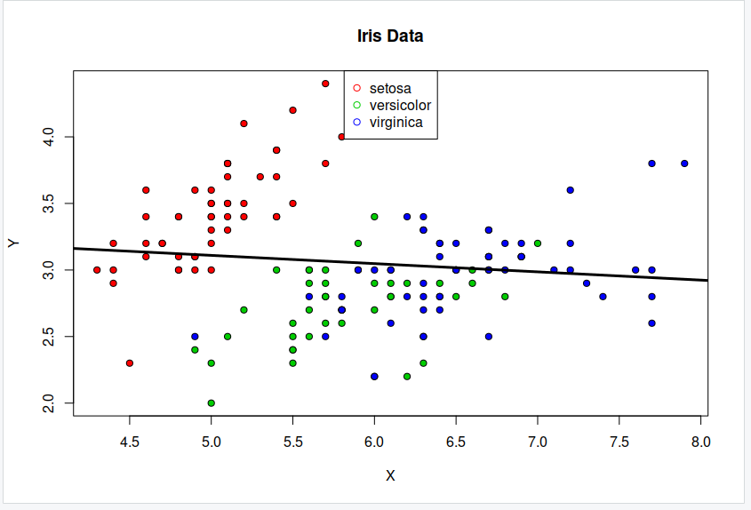

# Linear regression

We now possess a basic linear model for a given dataset. It would be valuable to assess the accuracy of this model. One way to achieve this is by computing the predicted y-values for each x-value in our original dataset and comparing them with the actual y-values. We can aggregate these individual discrepancies into a single comprehensive error metric by calculating the least squares. This involves squaring each difference, summing them all, dividing the sum by the total number of observations, and then taking the square root of the result. By squaring and subsequently taking the square root, we prevent negative errors from offsetting positive ones, thus providing us with an overall error metric to gauge the accuracy of our model.


## Preprocess the dataset

Lets test our code by using the example data from the mathsisfun link above.

~~~
Y<- iris[,"Sepal.Width"] # select Target attribute
X<- iris[,"Sepal.Length"] # select Predictor attribute
head(X)
~~~
{: .language-r}

~~~
Y<- iris[,"Sepal.Width"] # select Target attribute
X<- iris[,"Sepal.Length"] # select Predictor attribute
head(X)
~~~
{: .language-r}

~~~
[1] 5.1 4.9 4.7 4.6 5.0 5.4
~~~
{: .output}

~~~
plot(Y~X, pch=21, bg=c("red","green3","blue")[unclass(iris$Species)], main="Iris Data")
legend("top",levels(iris$Species), pch = 21, col = c("red","green3","blue")) 

~~~
{: .language-r}
>
{: .output}
~~~
model1<- lm(Y~X)
model1 # provides regression line coefficients i.e. slope and y-intercept
plot(Y~X, pch=21, bg=c("red","green3","blue")[unclass(iris$Species)], main="Iris Data")
legend("top",levels(iris$Species), pch = 21, col = c("red","green3","blue")) 
abline(model1, col="black", lwd=3) # add regression line to scatter plot to see relationship between X and Y
~~~
{: .language-r}

>
{: .output}

### Testing the accuracy of a linear regression model

Now, let’s use the line coefficients for two equations that we got in model1 and model2 to predict value of Target for any given value of Predictor.

~~~
# Prediction of 'Sepal.Width' when 'Sepal.Length'= 20
p1<- predict(model1,data.frame("X"=20))
p1

~~~
{: .language-r}
~~~
       1 
2.181251 
~~~
{: .output}

# Logistic Regression
We’ve now seen how we can use linear regression to make a simple model and use that to predict values, but what do we do when the relationship between the data isn’t linear?

> ## Logarithms Introduction
> Logarithms are the inverse of an exponent (raising a number by a power).
> ```
> log b(a) = c
> b^c = a
> ```
> For example:
> ```
> 2^5 = 32
> log 2(32) = 5
> ```
> If you need more help on logarithms see the [Khan Academy's page](https://www.khanacademy.org/math/algebra2/exponential-and-logarithmic-functions/introduction-to-logarithms/a/intro-to-logarithms)
{: .callout}

~~~
library(caTools)

set.seed(1)
split = sample.split(iris$Sepal.Length, SplitRatio = 0.75)
train = subset(iris, split==TRUE)
test = subset(iris, split==FALSE)
y<-train$Species; x<-train$Sepal.Length
glfit<-glm(y~x, family = 'binomial')
summary(glfit)
~~~
{: .language-r}

><pre style="color: black; background: white;">
>## Call:
>## glm(formula = y ~ x, family = "binomial")
>## 
>## Deviance Residuals: 
>##      Min        1Q    Median        3Q       Max  
>## -1.94538  -0.50121   0.04079   0.45923   2.26238  
>## 
>## Coefficients:
>##             Estimate Std. Error z value Pr(>|z|)    
>## (Intercept)  -25.386      5.517  -4.601 4.20e-06 ***
>## x              4.675      1.017   4.596 4.31e-06 ***
>## ---
>## Signif. codes:  0 '***' 0.001 '**' 0.01 '*' 0.05 '.' 0.1 ' ' 1
>## 
>## (Dispersion parameter for binomial family taken to be 1)
>## 
>##     Null deviance: 110.854  on 79  degrees of freedom
>## Residual deviance:  56.716  on 78  degrees of freedom
>## AIC: 60.716
>## 
>## Number of Fisher Scoring iterations: 6
></pre>
{: .output}


~~~
newdata<- data.frame(x=test$Sepal.Length)
predicted_val<-predict(glfit, newdata, type="response")
prediction<-data.frame(test$Sepal.Length, test$Species,predicted_val)
prediction
~~~
{: .language-r}

><pre style="color: black; background: white;">
>   test.Sepal.Length test.Species predicted_val
>1                4.6       setosa   0.014429053
>2                5.0       setosa   0.098256223
>3                4.8       setosa   0.038406518
>4                5.4       setosa   0.447809228
>5                5.1       setosa   0.152523368
>6                4.9       setosa   0.061887119
>7                4.4       setosa   0.005337797
>8                5.1       setosa   0.152523368
>9                5.0       setosa   0.098256223
>10               6.4   versicolor   0.991906259
>11               6.5   versicolor   0.995084059
>12               5.2   versicolor   0.229146102
>13               6.1   versicolor   0.964535637
>14               5.6   versicolor   0.688708107
>15               5.9   versicolor   0.908836090
>16               6.8   versicolor   0.998904845
>17               6.7   versicolor   0.998192419
>18               5.5   versicolor   0.572554250
>19               5.8   versicolor   0.857868639
>20               5.4   versicolor   0.447809228
>21               6.0   versicolor   0.942746684
>22               6.3   versicolor   0.986701696
>23               5.6   versicolor   0.688708107
>24               5.5   versicolor   0.572554250
>25               5.7   versicolor   0.785142952
>26               4.9    virginica   0.061887119
>27               7.2    virginica   0.999852714
>28               5.7    virginica   0.785142952
>29               5.8    virginica   0.857868639
>30               6.4    virginica   0.991906259
>31               6.1    virginica   0.964535637
>32               7.7    virginica   0.999988017
>33               6.3    virginica   0.986701696
>34               6.0    virginica   0.942746684
>35               6.9    virginica   0.999336667
>36               6.7    virginica   0.998192419
>37               6.2    virginica   0.978223885
></pre>
{: .output}

~~~
qplot(prediction[,1], round(prediction[,3]), col=prediction[,2], xlab = 'Sepal Length', ylab = 'Prediction using Logistic Reg.')
~~~
{: .language-r}

>
{: .output}
> ## Comparing the logarithmic and non-logarithmic graphs
>
> Convert the code above to plot the logarithmic version of the graph.
> Save the graph.
> Now change back to the non-logarithmic version.
> Compare the two graphs, which one do you think is easier to read?
{: .challenge}


> ## Removing outliers from the data
> The correlation of GDP and life expectancy has a few big outliers that are probably increasing the error rate on this model. These are typically countries with very high GDP and sometimes not very high life expectancy. These tend to be either small countries with artificially high GDPs such as Monaco and Luxemborg or oil rich countries such as Qatar or Brunei. Kuwait, Qatar and Brunei have already been removed from this data set, but are available in the file worldbank-gdp-outliers.csv. Try experimenting with adding and removing some of these high income countries to see what effect it has on your model's error rate.
> Do you think its a good idea to remove these outliers from your model?
> How might you do this automatically?
{: .challenge}


