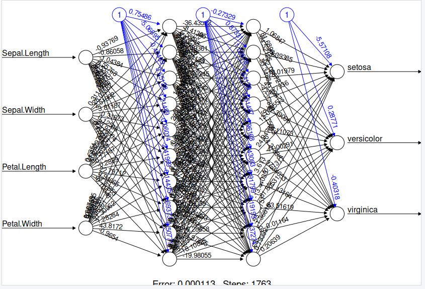

# Introduction

Neural networks, drawing inspiration from the workings of the human brain, represent a machine learning approach adept at discerning patterns and categorizing data, frequently leveraging images as input. This technique, rooted in the 1950s, has evolved through successive iterations, surmounting inherent constraints. Today, the pinnacle of neural network advancement is often denoted as deep learning.

## Perceptrons

Perceptrons serve as the foundational units within neural networks, mirroring the functionality of individual neurons in the brain. Typically equipped with one or more inputs and a solitary output, they operate by weighting each input and aggregating these weighted values. Subsequently, the summed result undergoes evaluation by an activation function, determining whether the neuron emits a signal. While some activation functions employ a straightforward threshold step mechanism, delineating between zero and one based on input magnitude, alternative designs may utilize different functions. Nevertheless, these functions commonly yield outputs ranging from zero to one and retain a step-wise characteristic.

### Coding a perceptron

The function requires three parameters: Inputs, a list of input values; Weights, a list of weight values; and Threshold, denoting the activation threshold.
Initially, we perform element-wise multiplication of each input with its corresponding weight.
Subsequently, the total sum of these products is computed. If this sum falls below the activation threshold, the output is zero; otherwise, it is one.

### Perceptron limitations

A solitary perceptron is incapable of resolving any function that lacks linear separability, necessitating the ability to partition input and output classes with a straight line. An illustrative instance is the XOR function below:

| Input 1 | Input 2 | Output |
| --------|---------|--------|
| 0       |0        |0       |
| 0       |1        |1       |
| 1       |0        |1       |
| 1       |1        |0       |

(Make a graph of this)

which yields zero output when all inputs are either one or zero, defying straightforward linear separation. This inadequacy, termed linear separability, was recognized in the 1960s, leading to a stagnation in neural network advancement for over a decade, often referred to as the "AI Winter."

## Multi-layer Perceptrons

A single perceptron lacks the capability to address functions that lack linear separability. To tackle such nonlinear challenges, we rely on multiple perceptrons, often organized into several layers. These layers constitute networks of artificial neurons, each capable of processing one or more inputs and producing a single output. The neurons interconnect within expansive networks, commonly comprising tens to thousands of units. Typically, these networks are structured in layers, encompassing an input layer, one or more hidden layers, and ultimately, an output layer.

### Training Multi-layer perceptrons

Multi-layer perceptrons need to be trained by showing them a set of training data and measuring the error between the network's predicted output and the true value. Training takes an iterative approach that improves the network a little each time a new training example is presented. There are a number of training algorithms available for a neural network today, but we are going to use one of the best established and well known, the backpropagation algorithm. The algorithm is called back propagation because it takes the error calculated between an output of the network and the true value and takes it back through the network to update the weights. If you want to read more about back propagation, please see [this chapter](http://page.mi.fu-berlin.de/rojas/neural/chapter/K7.pdf) from the book "Neural Networks - A Systematic Introduction".

### Multi-layer perceptrons training in R

We're preparing to construct a multi-layer perceptron to predict species in the iris dataset. With the dataset's four computed features representing two aspects of the plant, along with width and height, we'll set up four input neurons. The number of hidden layers can vary and is typically determined through experimentation. Since there are three different species of plants, we'll incorporate three output neurons.

Before delving into the construction, let's organize our data for ingestion into the neural network:

~~~
data(iris)
iris$setosa <- iris$Species=="setosa"
iris$virginica <- iris$Species == "virginica"
iris$versicolor <- iris$Species == "versicolor"
iris.train.idx <- sample(x = nrow(iris), size = nrow(iris)*0.5)
iris.train <- iris[iris.train.idx,]
iris.valid <- iris[-iris.train.idx,]
~~~
{: .language-r}

Now lets build our neural network, to which we use a library called neuralnet:
~~~
iris.net <- neuralnet(setosa+versicolor+virginica ~ 
                      Sepal.Length + Sepal.Width + Petal.Length + Petal.Width, 
                      data=iris.train, hidden=c(10,10), rep = 5, err.fct = "ce", 
                      linear.output = F, lifesign = "minimal", stepmax = 1000000,
                      threshold = 0.001)
~~~
{: .language-r}

><pre style="color: black; background: white;">
>hidden: 10, 10    thresh: 0.001    rep: 1/5    steps:    1763	error: 0.00011	time: 0.29 secs
>hidden: 10, 10    thresh: 0.001    rep: 2/5    steps:     661	error: 0.00035	time: 0.1 secs
>hidden: 10, 10    thresh: 0.001    rep: 3/5    steps:     688	error: 0.00044	time: 0.1 secs
>hidden: 10, 10    thresh: 0.001    rep: 4/5    steps:    1014	error: 0.00018	time: 0.15 secs
>hidden: 10, 10    thresh: 0.001    rep: 5/5    steps:    1023	error: 0.00023	time: 0.15 secs
></pre>
{: .output}

Now lets take a look at our trained neural network:
~~~
plot(iris.net, rep="best")
~~~
{: .language-r}

>
{: .output}
## Prediction using a multi-layer perceptron
### Confusion Matrix

To look at how our model performed, there are a number of ways you could look at it. The best way is to have look at the confusion matrix and luckily in R there is a built in function that does this for us. All we have to do is pass our prediction results to the table function. Furthermore, by summing the diagonal and dividing by the length of our test set we can come up with an accuracy value. 

~~~
iris.prediction <- compute(iris.net, iris.valid[-5:-8])
idx <- apply(iris.prediction$net.result, 1, which.max)
predicted <- c('setosa', 'versicolor', 'virginica')[idx]
cm <- table(predicted, iris.valid$Species)
accuracy <- sum(diag(cm))/length(iris.valid$Species)
sprintf("Accuracy: %.f%%", accuracy*100)
~~~
{: .language-r}

><pre style="color: black; background: white;">
>predicted    setosa versicolor virginica
>  setosa         25          0         0
>  versicolor      0         23         2
>  virginica       0          2        23
>
>[1] Accuracy: 95%
></pre>
{: .output}

> ## Changing the different characteristics of the neural network
> There are a number of characteristics you can change in your model, that may increase or decrease the performance of your model. have ago at adjusting the number of steps, linear output ("T" or "F") and number of hidden layers.
{: .challenge}

## Statistical test Manova

Its important to use a statistical test when you are trying to prove that your model is obtaining an improved performance over a different model. As a statistical test is a procedure for deciding whether an assertion (e. g. a hypothesis) about a quantitative feature of a population is true or false. We test a hypothesis of this sort by comparing the populations/predictions from each of the models. There are a lot of statistical test that exist, which all have particular use cases. Therefore, it is important to do your research before deciding on a particular test that you want to use. for this examples we are going to use manova, which is useful for finding statistical different between a group of two or more models. 

So lets run a manova, to see if there is any statistical difference. Firstly lets run it on our dataset:

~~~
sepl <- iris$Sepal.Length
petl <- iris$Petal.Length
res.man <- manova(cbind(Sepal.Length, Petal.Length) ~ Species, data = iris)
summary(res.man)
summary.aov(res.man)
~~~
{: .language-r}

><pre style="color: black; background: white;">
>           Df Pillai approx F num Df den Df    Pr(>F)    
>Species     2 0.9885   71.829      4    294 < 2.2e-16 ***
>Residuals 147                                            
>Signif. codes:  0 ‘***’ 0.001 ‘**’ 0.01 ‘*’ 0.05 ‘.’ 0.1 ‘ ’ 1
>
> Response Sepal.Length :
>             Df Sum Sq Mean Sq F value    Pr(>F)    
>Species       2 63.212  31.606  119.26 < 2.2e-16 ***
>Residuals   147 38.956   0.265                      
>
>Signif. codes:  0 ‘***’ 0.001 ‘**’ 0.01 ‘*’ 0.05 ‘.’ 0.1 ‘ ’ 1
>
> Response Petal.Length :
>             Df Sum Sq Mean Sq F value    Pr(>F)    
>Species       2 437.10 218.551  1180.2 < 2.2e-16 ***
>Residuals   147  27.22   0.185                      
>
>Signif. codes:  0 ‘***’ 0.001 ‘**’ 0.01 ‘*’ 0.05 ‘.’ 0.1 ‘ ’ 1
>
></pre>
{: .output}

So we may not have multiple models to test, but luckily every iteration that our model ran gives us a results. so what we can do is compare the iterations to see which one was the best

~~~
data_frm <- data.frame(iris.prediction)
data_frm$Species = iris.valid$Species
res.man <- manova(cbind(data_frm$net.result.1, data_frm$net.result.2, data_frm$net.result.3) ~ Species, data = data_frm)
summary(res.man)
~~~
{: .language-r}

><pre style="color: black; background: white;">
>          Df Pillai approx F num Df den Df    Pr(>F)    
>Species    2 1.7747   186.43      6    142 < 2.2e-16 ***
>Residuals 72                                            
>
>Signif. codes:  0 ‘***’ 0.001 ‘**’ 0.01 ‘*’ 0.05 ‘.’ 0.1 ‘ ’ 1
></pre>
{: .output}

### Cloud APIs

Google, Microsoft, Amazon, and many others now have Cloud based Application Programming Interfaces (APIs) where you can upload an image and have them return you the result. Most of these services rely on a large pre-trained (and often proprietary) neural network.

> ## Exercise: Try cloud image classification
> Take a photo with your phone camera or find an image online of a common daily scene.
> Upload it Google's Vision AI example at https://cloud.google.com/vision/
> How many objects has it correctly classified? How many did it incorrectly classify?
> Try the same image with Microsoft's Computer Vision API at https://azure.microsoft.com/en-gb/services/cognitive-services/computer-vision/
> Does it do any better/worse than Google?
{: .challenge}


